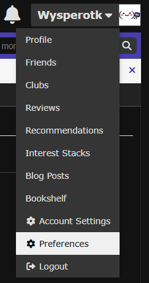
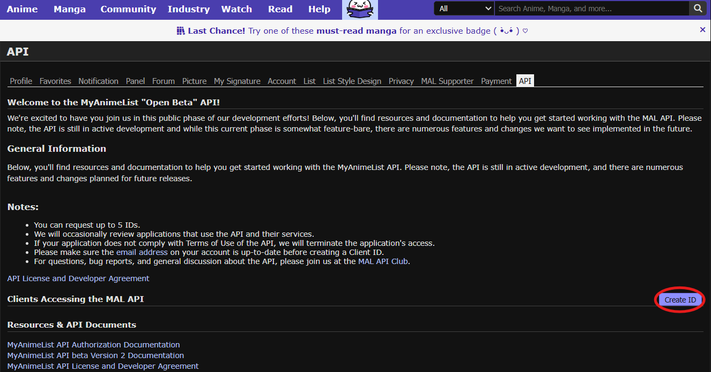
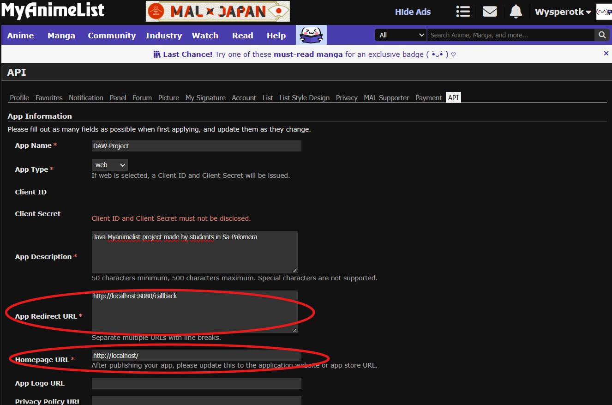
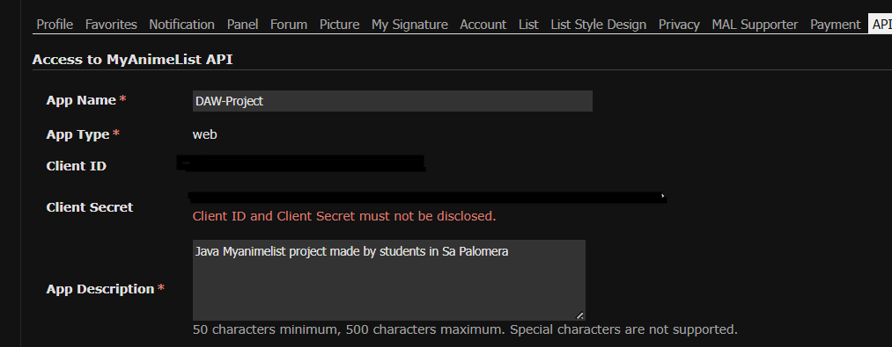

# 📚 MyAnimeListAPIConsuming

Este proyecto está enfocado en el uso de **JWT** y flujos de autenticación con **OAuth2** para consumir una API. En este caso, hemos elegido la **API de MyAnimeList**.

---

## 📋 Requisitos

Antes de comenzar, asegúrate de contar con lo siguiente:

### ☕ Java JDK 21 o superior
- Es obligatorio tener instalado **JDK 21 o superior** para ejecutar el proyecto en Java.
- Puedes descargarlo desde el siguiente enlace: [Descargar JDK 21](https://www.oracle.com/java/technologies/javase/jdk21-archive-downloads.html)

### 🐳 Docker Desktop
- Utilizamos **Docker** para montar un contenedor con la base de datos, facilitando así la ejecución del proyecto.
- Descárgalo desde: [Docker Desktop](https://www.docker.com/products/docker-desktop)

### 🛠️ Maven (no necesario si usas IntelliJ)
- **Maven** se encarga de gestionar las dependencias del proyecto.
- Si no usas IntelliJ, puedes instalar Maven siguiendo esta [guía oficial](https://maven.apache.org/install.html).

> **Nota:**  
> Si trabajas desde un IDE como IntelliJ, no es obligatorio instalar Maven por separado. El propio IDE se encargará de gestionar las dependencias.

### 💻 IntelliJ IDEA (opcional pero recomendable)
- Puedes descargar IntelliJ desde [aquí](https://www.jetbrains.com/es-es/idea/download/?section=windows)
- Recomendamos su uso para una mejor experiencia de desarrollo y compilación.

---

## 🚀 Antes de empezar

Para ejecutar esta aplicación, **cada usuario debe crear su propia aplicación en MyAnimeList**.

1. Crea una cuenta (o inicia sesión) en [MyAnimeList](img/appform.png)
2. Una vez dentro, accede a las preferencias de tu cuenta:

   

3. Dirígete a la sección **API** y haz clic en **Create ID**:

   

4. Rellena el formulario de creación de aplicación. Puedes usar los valores que prefieras, aunque te recomendamos algo similar a esto para facilitar las pruebas:

   

5. Una vez creada, **guarda bien tu `client_id` y `client_secret`**, ya que los necesitarás:

   

---

## 📦 Clonar y configurar el proyecto

Clona el repositorio:

```bash
git clone https://github.com/WysperOtaku/MyAnimeListAPIConsuming.git
```
Luego, abre el archivo src/main/resources/config.json. Este fichero tendrá un contenido similar a:
```json
{
  "client_id": "TU_CLIENT_ID_AQUI_PORFAVOR",
  "client_secret": "TU_CLIENT_SECRET_AQUI_PORFAVOR",
  "redirect_uri": "http://localhost:8080/callback",
  "code_challenge": "12345678901234567890123456789012345678901234567890"
}
```
### 🔒 Importante:
Rellena los campos client_id y client_secret con los valores obtenidos al crear tu aplicación en MyAnimeList.
El campo code_challenge puede ser el de ejemplo, aunque se recomienda generar uno propio de al menos 43 caracteres.

### ▶️ Ejecución de la aplicación

Primero por favor, levanta el contenedor de Docker🐳 de nuestra base de datos desde la raiz del proyecto
```bash
docker compose up -d
```

Una vez configurado el config.json, puedes ejecutar la aplicación desde tu IDE o por terminal con Maven:

```bash
mvn clean install
mvn exec:java
```
La primera vez que ejecutes el programa, te guiará para generar un token de acceso válido. Para ello:

Se abrirá una ventana del navegador pidiendo acceso a tu cuenta de MyAnimeList.

Tras aceptar, serás redirigido a una página en blanco.

No cierres la app: simplemente vuelve a ella. El token ya habrá sido recibido y guardado.

A partir de este punto, ya podrás realizar peticiones a la API de MyAnimeList, almacenar animes en tu base de datos y mucho más.


